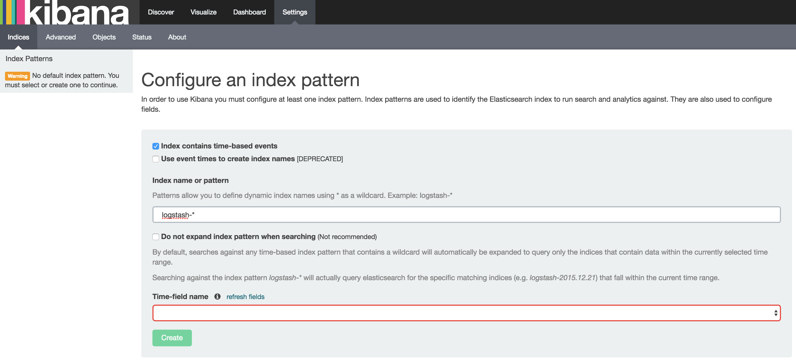

6 - Installing [Kibana]
============================

In this section we will be installing [Kibana] to use for viewing our events which
have been processed by [Logstash] and sent to [Elasticsearch].

Assumption(s)
-------------
* The [Vagrant] VM is still up and running from the [1st section](../1-Installing-Logstash/README.md).

Pre-Reqs
--------
Because we are installing [Kibana] on the same node as we installed [Logstash] and
[Elasticsearch] our pre-reqs should already be met. However for the list of pre-reqs
to install see below:

```
sudo apt-get update && sudo apt-get install -y default-jre-headless
```

* Add the [Elasticsearch] Apt-Key
```
wget -qO - https://packages.elastic.co/GPG-KEY-elasticsearch | sudo apt-key add -
```

How-To
------
Add the [Kibana] Apt-Repository:
```
echo "deb https://packages.elastic.co/kibana/4.6/debian stable main" | sudo tee -a /etc/apt/sources.list.d/kibana.list
```
Update Apt-Cache and install [Kibana]:
```
sudo apt-get update && sudo apt-get install kibana
```

One final note is to ensure that [Kibana] is enabled and starts on boot.

`Ubuntu 14.04`
```
sudo update-rc.d kibana defaults 95 10
```
`Ubuntu 16.04`
```
sudo systemctl enable kibana
```
If you are using this [Vagrant] VM to learn with then you will use the
`Ubuntu 16.04` method above.

Now you are ready to start the [Kibana] service:

`Ubuntu 14.04`
```
sudo service kibana start
```
`Ubuntu 16.04`
```
sudo systemctl start kibana
```

With [Kibana] up and running now you should be able to connect to the [Kibana
UI] using your browser. And the first time you connect you should see the following
screen:



The only setting that you should need to configure is the drop-down under
`Time-field name` which we need to set to `@timestamp` and then click `create`.
Once you do that you can then head on over to the `discover` tab and begin viewing
any events that have been collected.

[Home](../README.md)

[Elasticsearch]: <https://www.elastic.co/products/elasticsearch>
[Kibana]: <https://www.elastic.co/products/kibana>
[Kibana UI]: <http://127.0.0.1:5601>
[Logstash]: <https://www.elastic.co/products/logstash>
[Vagrant]: <https://www.vagrantup.com/>
